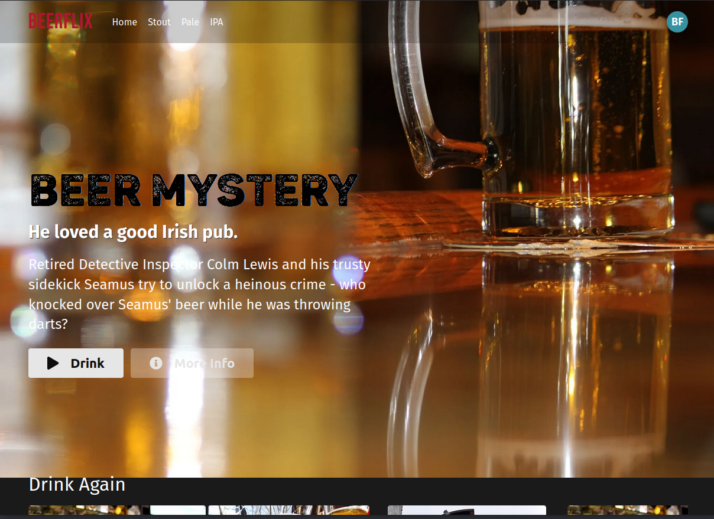

# BeerFlix

Refactor the HTML and CSS in `src/App.js` to use components.

* Your solution should have 10 components
* Replace all hard-coded data with the static data below
* Deploy your app to a public URL

## Rubric

* [:heavy_check_mark:] - Deployed to <https://jazzy-syrniki-e1e880.netlify.app/>
* [:heavy_check_mark:] - Has 10 meaningful components
* [:heavy_check_mark:] - No hard-coded data
* [:heavy_check_mark:] - Data is passed through the component hierarchy
